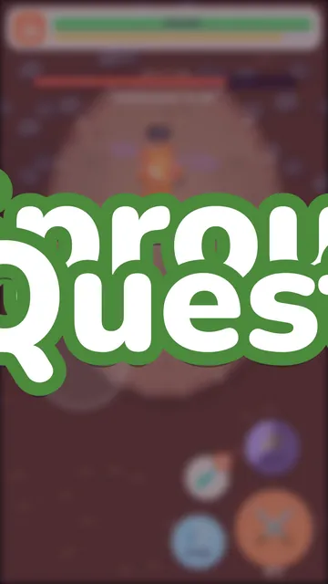

# 🌱 Sprout Quest

> **Sprout Quest has been built entirely by Claude Opus 5.5, starting on the model's release day (22 September 2026).**
>
> Everything here (the game code, the Blender art pipeline and every 3D model, the tests, CI and this repo) was written
> by Claude Opus 5.5 in [Claude Code](https://claude.com/claude-code) from plain-language requests. A human plays it on
> their phone and gives feedback between turns; no code or art has been written by hand.

**▶ Play it: https://aibengineering.github.io/sprout-quest/** (best on a phone, in portrait)

<p align="center">
  <a href="https://aibengineering.github.io/sprout-quest/"></a>
</p>

## How it was built

### Release day: a playable game from a handful of prompts (0.1.0)

The first version was built in one conversation on release day, and was a complete, playable game by the first push:
a prologue, four areas, real-time battles, guardian bosses, a village to rebuild and gear to craft. Measured from the
Claude Code session log, up to that first push:

| | |
| --- | --- |
| Human prompts to build the game end to end | **11** (plus 3 more to set up GitHub and this repo) |
| Wall-clock time | ~4 h 25 min, from first prompt to published repo |
| Model calls | ~230 |
| Tool calls (shell commands, file edits, Blender renders, headless browser tests…) | ~245 |
| Output tokens | ~565K |
| Input tokens | ~99M total: ~450 uncached + ~716K cache writes + ~98.4M cache reads (the conversation is re-read from cache on every call) |

The prompts, roughly: *make a cute mobile adventure game with a fight → level → craft loop* · *use Bun* ·
*give me a link to play it* · *fix clipped menu text* · *install Blender and make cute 3D art; make weapons feel
different and powerful* · *add story, bosses and milestones that gate progression* · *make the first-time
experience less overwhelming* · *start with a prologue before the village* · *move the bag near the thumbs* ·
*let me close the menu from the bottom* · *fix two bugs with the forge quest*.

### Since then: playing it and iterating (0.2.0 onward)

Since the first release, development has been a loop: play the game on a phone, describe what feels off, and have
Opus 5.5 rework it. Some of the bigger rounds so far:

- **Progression overhaul (0.2.0):** a new area, woodcutting and mining with tool tiers, four weapon classes with monster
  and ore tracks, weapon handling, stamina, level-up screens and gear that stays a mystery until you reach its level
- **Playtest data:** an in-game play report (fights, stamina, deaths, time per area) exported after a playthrough and
  handed back to Opus 5.5 to tune the balance against real play, not just the balance model
- **Engineering:** splitting the largest modules, an end-to-end browser test, CI, a `dev` → `main` release flow and
  in-game patch notes
- **Visual pass (0.2.1):** a sharper, outlined hero whose every armor changes their silhouette, and axes and picks
  that swing into the tree or rock
- **Side stories (0.3.0):** Poppy's Bunny, a small story told with camera pans, emoji feelings over people's heads and
  face-to-face dialogue, built on reusable pieces (story characters, scenes, story steps) for the ones to come

Each release's player-facing changes are in the in-game patch notes (`src/version.ts`).

## The game

A cute, mobile-first little adventure game. Wander from Sowerby through tall grass, get pulled into
real-time arena battles, level up, chop and mine your way up the material tiers, and craft better gear at the Forge,
then push east toward stronger monsters and the dragon at the end of Ember Peak.

No runtime dependencies. Characters, monsters, weapons and scenery are cute cel-shaded 3D models built with
Blender Python scripts in `art/` and pre-rendered into sprite atlases; sounds and the map are generated in code.
The music is written as code too, and played by a real orchestra: recordings from VSCO 2 Community Edition
(public domain), see [docs/music.md](docs/music.md).

## Play

```sh
bun install
bun run dev        # http://localhost:3000, and prints a LAN URL to open on your phone
```

The title screen shows a loading bar (game code, then sprite download in MB, then menu icons) and only offers
Continue / New Game once everything is in, so nothing starts half-drawn. On a phone, "Add to Home Screen" for a
fullscreen, app-like experience. Progress saves automatically (localStorage).

Every push to `main` runs the typecheck and tests, builds the site and deploys it to GitHub Pages
(`.github/workflows/deploy.yml`).

## Branches and releases

Work happens on `dev`; `main` is what's live. `main` only takes pull requests, and CI (`.github/workflows/ci.yml`)
must pass first:

- **Typecheck, tests and build**, fast balance contracts, and the **six-scenario browser smoke test**, on every pull
  request and every push to `dev` that touches the game (documentation and CI-only changes skip them)
- **Full browser regression and balance**, only on game-changing release pull requests into `main`, or manually
  through Actions → CI → Run workflow (select `dev` for a batch checkpoint). Routine `dev` pushes and non-release
  pull requests do not run the exhaustive suite
- **Version bump and patch notes**, on pull requests into `main`: the `version` in `package.json` must be newer than
  `main`'s, and the top entry of `PATCH_NOTES` in `src/version.ts` must describe it (`scripts/check-release.ts`); pull
  requests that only change documentation (Markdown, `docs/`) or CI tooling (`.github/`) skip it, since they don't
  change the game

So a release is: bump `version` in `package.json`, add its patch notes at the top of `src/version.ts` (and keep
extending that one entry, moving its date along, as more lands on `dev` before the merge), and open a pull
request from `dev` to `main`. The version lives only in `package.json`; the game reads it from there, and players
see a dot on the patch notes until they've read the new ones.

## Build and test

```sh
bun run build          # static site in dist/: host anywhere (GitHub Pages, Netlify, itch.io…)
bun run build --dev    # the same, with the dev tools (save slots and presets, see below) for a test server
bun run test           # rules, balance, story, routes and map tests (isolated mocks)
bun run typecheck
bun run balance        # one HTML/JSON/CSV report: real combat for every weapon/stage, plus pacing and economy estimates
bun run balance:check  # fail if the native combat behavior contracts are broken
bun run balance:estimate # the older ideal-hit/pacing/economy table, for comparison
bun run sim            # a simulated playthrough (test tooling, see sim/README.md)
bun run sim:compare -- <report.json>   # a real play report against the simulated playthroughs
bun run e2e            # fast browser smoke (same as e2e:fast); six representative flows
bun run e2e:full       # exhaustive browser regression; checkpoint/release only (add --shots for screenshots)
```

### Verification policy: keep iteration fast

The full browser suite earns its place by checking whole stories, every weapon and monster, crafting transactions,
room/route transitions, saves and presentation edge cases that unit tests cannot reach. It is **not a per-edit
gate**. The October 2026 local audit measured 73 scenarios at about **10½ minutes**, versus a **0.2-second build**,
**6.8-second typecheck** and **5.9-second unit suite**. CI also runs extra crafting and playtest checks; its exhaustive
regression can take longer. The six-scenario fast suite passed locally in **45 seconds with four workers**, and
**56 seconds with two workers** (CI's default concurrency on a four-core runner). Browser installation and CI setup
are additional overhead. These timings depend on hardware and load, not promised limits.

- **Small map/art/content edit:** playtest the affected area on `bun run dev`, plus relevant unit tests, e.g.
  `bun test --isolate tests/routes.test.ts tests/village-layout.test.ts`. Do not run the full browser suite or
  balance report for every edit.
- **Normal code checkpoint:** `bun run typecheck`, `bun run test`, `bun run build`; use `bun run e2e` for a browser
  sanity check. Routine CI runs these fast checks, not exhaustive regression.
- **Changed a particular browser flow:** `bun run e2e:full --only '<scenario name fragment>'`. Run the affected
  scenarios even when they are outside the fast subset.
- **Batch checkpoint:** run the full regression after roughly **ten gameplay commits since the last successful
  full run**, or sooner for broad combat, save, story or navigation changes. This is a developer checkpoint, not an
  automatic every-ten-commits CI trigger. Consult the last successful full Actions run rather than counting docs-only
  commits. Run CI manually on `dev` to include all auxiliary browser checks and the balance report.
- **Release:** every game-changing PR into `main` runs the full regression automatically, including 0.3.x patches;
  require a green full job on the release head before merging. Major releases are not the only ones worth checking.
  If a full run fails, fix it and rerun the affected checks, then obtain a complete green run before release.
- **Balance tuning:** run `bun run balance` when changing combat/progression/economy; do not generate its 37–59-second
  simulation report for unrelated edits. Routine CI keeps the inexpensive `balance:check` contracts.

The fast browser suite reuses six existing scenarios and all their assertions: new-game prologue, fight/level-up,
campfire/Waystone travel, tree/rock gathering, Forge recipe visibility and preset save isolation. It deliberately
does not cover whole side stories, all weapons/monsters or software-WebGL crafting. Passing it is a sanity check,
not evidence that full regression passed. `bun run e2e` now defaults to this subset; use `e2e:full` explicitly for
the old exhaustive behavior.

### Dev tools: save slots and preset saves

The dev server (and `bun run build --dev`, for hosting a test build) adds a **🛠 Save slot** button to the title
screen. Each slot keeps its own save and play report, and **main** is your real playthrough, so testing never touches
it. From there you can switch slots, copy one, or start a **preset**: a save partway through the game (Poppy's story at
each step, each guardian, Glimmer Hollow, the dragon, a sandbox with everything), with the gear and levels from the
balance checkpoints. Presets also work as links: `?preset=poppy-chase`, and `?slot=main` to go back. Outside the main
slot a small badge at the bottom of the screen shows which slot you're in. None of this is in the published build
(`__DEV__` is compiled out).

For agent playthroughs, dev builds also have an opt-in controller with no player-facing controls. Open
`http://localhost:3000/?autoplay=1` to automate combat and gathering, or use `?autoplay=combat` / `?autoplay=gather`
for just one. It also works with slot/preset URLs. From the browser console, `window.sproutPlaytest.enable()` turns
both on; `enable({ combat: true, gather: false })` selects modes, `disable()` stops, and `status` shows what is active.
It steers and uses normal attacks, dodges, unlocked skills, available potions and timed chopping/mining strikes.
Navigation, dialogue and choosing a node stay manual. Stats, cooldowns, rewards and defeat rules apply normally;
automated play reports describe a bot's performance. It is off by default, never stored in the save, and the
production build fails if its console API appears in the bundle. GitHub Pages builds without `--dev`.

The browser tests (`tests/e2e/smoke.ts`) need Playwright's Chromium once:
`bunx playwright-core install chromium-headless-shell`. The full suite plays a new game through the prologue, wins a fight
through its level-up screens, mashes every weapon class, fights every monster, mines crystal, checks the Forge's
mystery cards, exports a play report, plays Poppy's side story start to finish and starts a preset save in its own
slot, failing on any page error.
`bun run e2e:full --only <name>` runs just the scenarios whose name contains it (including those outside the fast subset).

On a minimal Linux installation, screenshots also need an emoji font for the HUD, menu buttons and speech bubbles.
Install `fonts-noto-color-emoji`, or give the test browser an existing font without installing it globally:
`SPROUT_EMOJI_FONT=/path/to/NotoColorEmoji.ttf bun run e2e --shots` (also works with `bun run e2e:playtest`).
Screenshot runs check for the font before launching; the local font configuration stays in test tooling and is not
part of the production build. Visual playthrough captures should keep WebGL enabled and use a device scale factor
of 2 for phone screenshots; the default smoke runner disables WebGL for most logic checks.

Two visual tools for the 3D art, in the same headless Chromium: `bun run tests/e2e/hero-armors.ts [out.png]` draws the
hero in every armour (idle, walking, from behind, sword in hand) to check worn armour after re-exporting it, and
`bun run tests/e2e/icons3d.ts` checks the model-drawn inventory icons.

## Play report

Every fight (time, swings, hits, damage dealt and taken, potions, gear) and every gathering run is logged in the
browser. **More → Play report** downloads (or copies) it as JSON with a per-area summary, the level and crafting
timeline and the raw events, to tune the balance against real play.

## Story and progression

**Prologue.** You wake up in the Quiet Glade west of the village, pick up a Twig Sword, and fight your way down the
forest path: a slime (attack) and then a Hopbun (its charge teaches dodging), with only ⚔️ and 💨 on screen and coaching
bubbles. Reaching Sowerby plays a letterboxed camera tour with Elder Oswin, Veyra's priest (the empty plots, the ruined forge, the
guarded roads east). From there systems unlock one at a time with a small card: 🎒 Bag, 📜 Journal, ✨ weapon skill,
🏡 Village building (starting with repairing the forge), ⚒ crafting, then new building plots as guardians fall.

Smoke from Ember Peak has made the monsters grumpy, and guardians block the roads. Elder Oswin guides you through a
chain of chapters, and the current goal is always shown in the 📜 tracker at the top of the screen, with a progress bar
for the materials it needs.

| Chapter | Goal |
| --- | --- |
| Prologue | Wake in the glade → find a sword → beat a slime and a Hopbun → reach the village |
| 1 | Gather materials in the meadow → repair the Forge → craft gear → craft a Stone Axe and Pick → build a Cottage |
| 2 | 👑 **Slime King** (Lv 5) guards Whisper Woods → upgrade the Forge to a Smithy |
| 3 | 🐺 **Alpha Woolf** (Lv 9) guards Echo Cavern → build the Waystone |
| 4 | 💎 Mine crystal in **Glimmer Hollow** |
| 5 | 💎 **Crystal King** (Lv 14) guards Ember Peak → upgrade to a Master Forge |
| Finale | 🐉 **Emberwyrm** (Lv 20), then build your Manor |

- **Guardian gates**: each road is physically blocked until you beat its guardian, like gyms. Guardians have their
  own attack patterns and summon helpers. Beating one opens the road, lights a 🔥 **campfire checkpoint** (heal, respawn,
  warp point) and drops a **trophy** needed for the next village upgrade.
- **Village construction**: Home (Tent → Cottage → Manor, +max HP), Forge (Forge → Smithy → Iron Smithy → Crystal Kiln → Master
  Forge, one level per star tier of gear), Garden (Poppy's fenced field of plots, 6 → 12 → 20, and more free potions), Training Yard (+attack) and Waystone (fast travel). Buildings
  visibly change in the village.
- **Levels you can feel**: a combat level-up pauses the game on its own screen with your stat changes and what you're
  now ready for (a guardian, a new area). Woodcutting, Mining and weapon handling levels get a screen too, listing what
  they just unlocked in the Forge.

**Side stories.** Alongside the main chapters, small stories wait to be stumbled into. People show how they feel from
across the map with emoji bubbles (😨 cornered, 😢 missing something, 💖 happy again), and you talk to them face to face.
The first, **Poppy's Bunny**, opens once you've settled in the village: a girl cornered by slimes at the mouth of the
**Secret Grove** off the meadow's south-east corner (sneak up behind them for a surprise attack), a walk home with her
following you, a stolen toy, a gauntlet of tougher monsters down the grove and the **Big Bun** mini-boss in its
clearing. It ends with a **perk**, Trail Boots (+25% walking speed on the map), and the grove's oaks and rocks free to
gather. Side stories show in the tracker while you're in
one, and in the Journal.

## Areas

Each area past the village is a hand-drawn route (`src/routes.ts`), Pokémon style: a path that winds through the
area, shorter grassy crossings and longer dry detours, deliberate gathering stops, ponds or lava, and signs.
Resources follow named groves and workings; Poppy’s grove and Pip’s gallery are discoveries opened through their
quests. Tests check route choices, shortcut value, gathering clearance and quest gates. Each area has its own material tier.

| Area | Lv | Monsters | Materials |
| --- | --- | --- | --- |
| 🌳 Quiet Glade | – | Prologue only | Where your story begins |
| 🏡 Sowerby | – | – | Forge, Veyra's Spring and shrine, Elder Oswin, building plots, Poppy's field at the east end |
| 🌼 Sunny Meadow | 1–3 | Slime, Hopbun | Goo, Fluff, Clover · 🪵 oak, 🪨 stone |
| 🌲 Whisper Woods | 4–7 | Sporecap, Woolf, Hopbun | Shroom Cap, Fang · 🌲 pine, 🟠 copper |
| 🪨 Echo Cavern | 8–11 | Flapper, Pebblor, Sporecap | Bat Wing, Golem Core · ⚙️ iron |
| 💎 Glimmer Hollow | 11–13 | Glimmer Slime, Flapper, Pebblor | Glimmer Jelly · 💎 crystal |
| 🌋 Ember Peak | 13–17 | Impy, Magma Slime, Pebblor | Ember, Imp Horn |
| 🐉 Dragon Lair | 20 | Emberwyrm (boss) | Dragon Scale |

- **Monsters in the grass**: you can see them wandering the tall grass (a ×2/×3 badge means friends are hiding
  with it; ✨ golden ones drop double loot). Get close and one spots you ("!") and gives chase, but you're faster.
  Touch one to fight it; tap Attack next to one that hasn't seen you for a surprise attack (they start dazed). Tall
  grass is never quite safe either: unseen monsters can still ambush you as you wade through it.
- **Battles**: no wipe or countdown. The camera swoops in on you, and you land in a clearing dressed in the area's
  scenery and ambient life. Win and it swoops back out, with loot and XP stacking up on the right. Guardians and the
  dragon fight inside an old stone ring with their full fanfare. Drag to move; ⚔️ attacks the way you last moved,
  with a small nudge onto an enemy that's nearly dead ahead (an arrow at your feet shows where); 💨 dodge gives brief
  invincibility; ✨ uses your weapon's skill; 🧪 drinks a potion. Enemies telegraph attacks: shaking and glowing
  before a charge, red circles before a slam.

## Weapons

Four classes, each with its own combo, animation and hitbox (hitboxes sweep with the weapon, so what you see is what
you hit), and a weapon at every tier from ★ to ★★★★★:

| Class | Combo | Skill | Stamina |
| --- | --- | --- | --- |
| 🗡️ Sword | slash → backslash → lunging stab | Spin | 3 |
| 🔨 Hammer | two overhead slams, each sending a line of rock spikes forward | Quake | 2 (slow to refill) |
| 〰️ Whip | two long lashes → a crack at the tip | Twirl | 3 |
| 🪄 Wand / slingshot | shot → shot → a weaker three-way spread | Nova | 3 |

- **Stamina**: every swing or shot spends a pip (shown under the attack button). Pips come back only once you pause,
  and each class rests after its full combo, so mashing gets you a combo and then a wait.
- **Two tracks**: gatherer weapons (swords and hammers in stone, copper, iron and crystal) are forged from ore and
  hit a little harder, plainly. Hunter weapons (whips and wands from jelly, spores, bat wings and glimmer) are forged
  from monster drops, hit a little softer, and carry the monster's trick: jelly slows, spores poison, bat weapons
  drain life, glimmer sparks chain to a second foe. Ranged wands aim lower still, since they never walk into danger.
  The ★★★★★ legendaries need both tracks' materials: the Ember Blade, Dragontail Whip, Wyrmfire Wand and the
  Wyrmbreaker, a war hammer whose slam breathes a fan of dragonfire that leaves the ground burning.
- **Weapon handling**: winning with a class levels its handling, and better weapons of that class need it. Each class
  has a ten-level path (Bag → Skills → Path): its special at Lv 2, its own ability at Lv 3, faster attacks and
  stronger specials after, paced so one weapon masters around the Emberwyrm.
- **Balance**: `bun run balance` measures every weapon over a typical fight (sustained damage and opening burst
  against its tier, reach and area as a share of the arena, skill coverage) and prints the expected progression
  through the story. The tests keep each within its targets. What the targets are, what they assume about how many
  fights each area has, and how to re-tune them: [docs/balance.md](docs/balance.md).

## Gathering and crafting

- **Woodcutting and Mining**: craft axes and picks at the Forge (Tools tab), then chop glowing trees and mine glowing
  rocks along the routes. Each tool gathers its own tier quickly and the next tier up slowly, so you chip the next
  material to forge the tool that mines it properly: Stone Axe (oak, slowly pine) → Copper Axe; Stone Pick (stone,
  slowly copper) → Copper Pick → Iron Pick → Crystal Pick.
- **The minigames**: chopping is a bar with a green sweet spot; mining is a rock face where you strike when the pick
  lines up with the glowing seam. You swing the axe or pick for your tool's tier at a close-up of the tree or rock,
  which shows every blow: a notch that deepens with chips, sawdust and falling leaves, or cracks that run from where
  the pick lands (forking on perfect hits) with stone chips, sparks and dust. When it's through, the tree topples off
  its stump and lands in a shower of leaves, or the rock splits along its cracks and tumbles apart, and the materials
  you earned pop out and fly to your bag. Clean hits build a streak that speeds things up; a flawless job gives one
  extra.
  The same resource gives the same materials, skill XP and rare finds on any terrain, and regrows in two minutes.
  Rich gathering destinations offer more nodes together; monsters affect the journey, not the contents of a tree.
  Skill levels widen the sweet spot and unlock the better tools.
- **The Forge**: 20 weapons, 10 armors (each changes how your hero looks), 4 charms and 3 potions. Gear you haven't
  reached the level for (Forge, gathering skill or weapon handling) stays a mystery: a silhouette, its class and tier,
  and the level that reveals it. The 🗺️ Map lets you warp home from anywhere and hop to discovered areas.

On a computer the game shows key hints on every button (switching back to touch hints as soon as you touch the screen):
WASD/arrows move, J/Space attack (hold to combo), K dodge, L skill, H potion, R run, E interact, B bag, Q journal.
In menus and dialogs: Enter/Space confirms, Esc cancels or closes, 1–5 or ←/→ switch tabs.

## Art pipeline (Blender)

Every sprite comes from Blender Python scripts in `art/`: primitives with a cel-shading material and inverted-hull
outlines, posed per frame and rendered with EEVEE. It runs headless, with no Blender UI needed.

```sh
bun run art              # re-render everything (~30 min on CPU), then pack into public/assets/
bun run art monsters     # re-render one group: hero | monsters | weapons | env | icons | icons2 | npc | gather
bun run art icons3d      # gear, tool, potion, meal and material icons, from their 3D models (no Blender needed)
BLENDER=/path/to/blender bun run art
```

- `art/lib.py`: toon material, outlines, primitive builders, ortho camera and render helpers
- `art/hero.py`: the hero (every armor looks different) plus the walk cycle, and the villagers who share its rig
- `art/monsters.py`: monsters with idle loops and golden variants
- `art/gather.py`: close-ups for the chop/mine minigame: trees whole and split into stump and top, big rocks, and
  the axes and picks for every tool tier
- `art/weapons.py`, `art/env.py`, `art/icons.py`: weapons (built from reusable parts per material), scenery and
  buildings, menu icons
- `art/pack.py`: trims frames and packs them into WebP atlases plus `atlas.json`

Characters (the hero, the villagers and every monster) and every weapon are real-time 3D (the weapon rides in the hero's hand, the arm following each swing, or on the back or hip on the map): `art/models.py` exports each
one with its animations to `public/assets/models/*.glb` (compressed with gltfpack; `bun run art models`), and
`src/models.ts` draws them with a cel shader and inverted-hull outlines that match the Blender material. Each character
is rendered into a small image at its on-screen size and drawn like a sprite, so the 2D world, depth sorting and every
effect work unchanged. Without WebGL the game falls back to the characters' sprites, and to procedural canvas drawings
if the atlas can't load either. Dev builds show a performance readout (fps, frame time, 3D renders, GPU).

The hero is one base model (`hero_base`: head, face, hands, feet and hair) and one small model per armour
(`armor_<id>`), whose pieces hang on the base's pivots when it's worn; only what you wear loads at startup. Crafting and
building scenes are 3D too: each item or building is a model of its layers (`public/assets/crafting3d/<id>.glb`, from
the same Blender builders the game wears and holds; `bun run art crafting` and `bun run art buildings`), all loaded on
the title screen, and played live with the same toon look as the ingredients fly in from the bag.

Every material has a small 3D model too (`crafting3d/mat_<id>.glb`, `bun run art materials`, from the builders in
`art/icons.py`), loaded in the background once the title is up: its pieces tumble into crafting scenes. Wherever one
item is shown on its own (the "You found" card, the Forge's and the Bag's tags) it pops in and turns once round in live
3D from its model, then rests until you drag it round; the Bag opens on you in what you're wearing (`src/itemview.ts`).
One view is live at a time, on the same shared renderer. The inventory icons of gear, tools, potions, meals and materials are rendered from those
same models (`bun run art icons3d [id,...]`, scripts/icons3d.ts, in headless Chromium with the game's own renderer;
`--sheet out.png` writes a before/after contact sheet, `--check` lists icons out of date with their models), so changing
a model changes its icon. Without WebGL, items show their icons.

## Code map

- `src/main.ts`: the canvas, the frame loop, and wiring the page's buttons to the game
- `src/game/`: the game's flows, sharing state through `G` in `context.ts` (save, map, fight, mode, transitions)
  - `fights.ts`: starting and finishing fights, rewards, the swoop in and out, in-battle coaching
  - `gathering.ts`: the chop/mine minigame on the map
  - `story.ts`: quests, unlock cards, Elder Oswin, the village cutscene
  - `stories.ts`: side stories as steps (a check, then a scene), and the characters and monster groups each step puts
    on the map; one file per story in `stories/` (`poppy.ts`)
  - `scenes.ts`: writing scenes as plain async code: pan, follow, walk, emoji bubbles, dialogue, narration
  - `rewards.ts`: loot rows, level-up screens, gear the Forge reveals
  - `interact.ts`: what the action button does next to each kind of map object
  - `menu.ts`: what the menu's buttons do (crafting, building, travel, the play report)
  - `waypoint.ts`: where the goal arrow points; `title.ts`: loading and the title screen
- `src/battle/`: arena combat
  - `battle.ts`: the fight simulation (you, strikes, shots, hazards, shockwaves)
  - `monsters.ts`: how each monster fights, one entry per kind
  - `elements.ts`: each weapon element's colors and on-hit trick
  - `render.ts`: drawing the fight, the themed clearings and the overlay; `pose.ts`, `types.ts`: shared pieces
- `src/overworld.ts` / `src/world.ts`: the map (glade and village generated, routes from `src/routes.ts`), collisions,
  grass encounters, rendering
- `src/routes.ts`: the hand-drawn route maps, one character per tile (legend at the top)
- `src/roamers.ts`: monsters wandering the grass: noticing, chasing, surprise attacks
- `src/echoCave.ts` and `src/game/underground.ts`: the separate cave map, entrance, exit and save restoration
- `src/procession.ts`: the Pebblors' underground procession you tail (who sees what,
  where you fall to, the way back up), for the side story in `src/game/stories/drums.ts`
- `src/actors.ts`, `src/bubble.ts`: story characters on the map (walking paths, following you, moods, talking) and
  their emoji speech bubbles
- `src/weapons.ts`: each class's moveset (combo timings, hitbox shapes, stamina) and the damage model
- `src/data.ts`: monsters, zones, guardians, gear, recipes, tools, village projects and story chapters
- `src/rules.ts`: pure stat, damage, XP, crafting and gathering rules (unit tested)
- `src/quests.ts`, `src/unlocks.ts`: story progression and system unlocks
- `src/gather.ts`: the chopping and mining minigames; `src/nodeart.ts` draws the close-up tree or rock (the notch
  and the fall, cracks and the break) and `src/particles.ts` the chips, dust, sparks, leaves and loot
- `src/stats.ts`: the play report log
- `src/balance.ts`: balance targets for fights, pacing, weapons and the material economy; `bun run balance` prints
  them, `tests/balance.test.ts` enforces them, and [docs/balance.md](docs/balance.md) explains them
- `src/assets.ts`, `src/sprites.ts`: sprite atlas loading and drawing, and the procedural fallbacks
- `src/ui.ts`, `public/`: DOM HUD, menus, styles
- `src/slots.ts`: which save slot is in use (always the main one in the published game)
- `src/dev/`: dev-build-only tools: `presets.ts` (preset saves), `devtools.ts` (the title's slot panel, `?preset=`)
